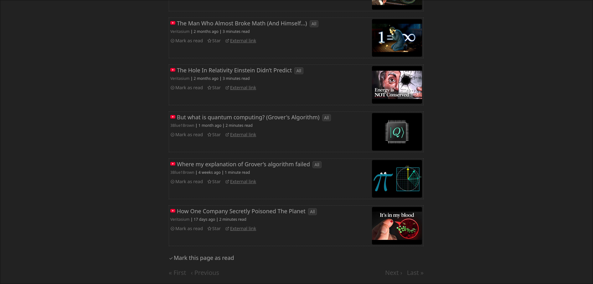

# Miniflux YouTube Thumbnails Firefox Extension

This Firefox extension automatically adds YouTube video thumbnails to Miniflux RSS feed items.

## Features

- Automatically detects YouTube video links in Miniflux feed items
- Adds thumbnail images from YouTube's thumbnail service
- Works with dynamically loaded content

# Images

# Installation

Warning: part of this process involves allowing unsigned extensions to be installed

- Type about:config in Firefox
- Accept the warning
- Search for `xpinstall.signatures.required`
- Double-click to set it to false
- Go to about:addons -> gear icon -> "Install Add-on From File..."
- Install your .xpi file

# Credits

Based on this [Chrome extension](https://github.com/sentriz/miniflux-youtube-thumbnails/tree/master) by [sentriz](https://github.com/sentriz)
